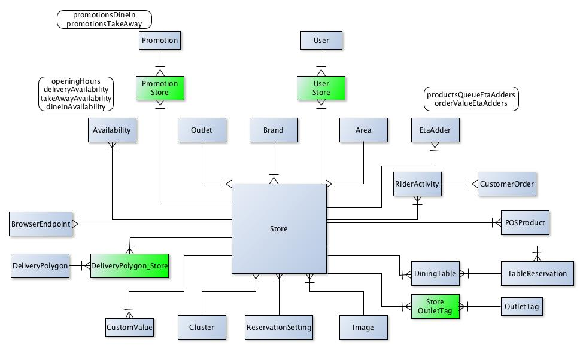
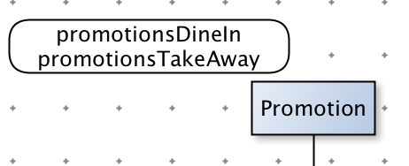

# Zest ERD

## Example

Store ERD

Description :

* Properties

from diagram above Store Entity have 2 properties (promotionDineIn and promotionsTakeAway) to Promotion entity

* Junction Table

ManyToMany relationship have junction table colored like above
